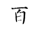
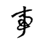

# 项目代码运行报告
## 项目目标
楷书四大家是中国书法史上以楷书成就最高的四位书法家的合称，分别是唐代的欧阳询（欧体）、颜真卿（颜体）、柳公权（柳体）和元代的赵孟頫（赵体）。他们的楷书风格各具特色，对后世影响深远，至今仍是书法学习的典范。

楷书四大家的书法特点可以用四个字精炼概括：

欧体（欧阳询）——险
如悬崖勒马，字势峻拔，结构内紧外展，笔法方硬挺拔，代表作《九成宫醴泉铭》堪称"楷法极则"，后世称"欧楷无败笔"。

颜体（颜真卿）——雄
似壮士挥拳，笔画浑厚如"屋漏痕"，横细竖粗，结体宽博大气，充满盛唐气象，《多宝塔碑》筋骨内含，《颜勤礼碑》老辣苍劲。

柳体（柳公权）——劲
若铁骨铮铮，笔画瘦硬如刀削，起收笔棱角分明，中宫收紧而四维开张，《玄秘塔碑》将楷书法度推向极致，与颜体并称"颜筋柳骨"。

赵体（赵孟頫）——润
似行云流水，楷中带行，笔意圆转流畅，结体秀美飘逸，《胆巴碑》打破唐楷严整，开创"尚意"新风，被誉为"赵字无真楷"。

我们使用的数据集就是欧颜柳赵四大家的书法字体，每位书法家有500张不同的字的图片。我们取0.8用作训练集，0.2用作验证集。这四种字体，外行人来看经常容易分不出字属于哪种楷体，所以我们决定使用深度学习训练一个神经网络，来识别字体属于哪种楷体。

## 项目架构
我们采用了4种架构，分别是ConvNet3，ConvNet5，ResNet，ConvNetMix，在figures文件夹中我们展示了每一种架构的训练效果和模型在验证集上展现的准确率acc，我们在ConvNetMix架构上达到了最高的识别准确率acc-92.34%，这里主要详细介绍ConvNetMix架构。

### ConvNetMix
（特别感谢向阳学长提供的思路）

这套架构的idea来自于向阳学长的多尺度特征融合，

